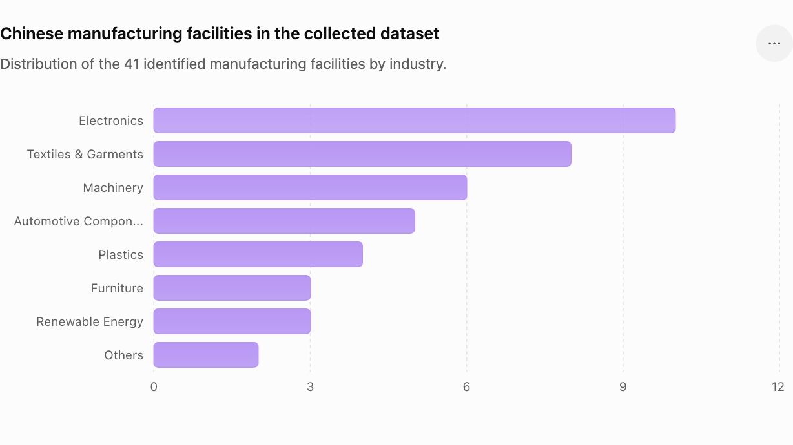

# Market Analysis Report  
## Chinese Manufacturing Presence in Vietnam & Opportunity for On-Device Chinese–Vietnamese Voice AI

**Project:** Vân Ngữ – On-device Industrial Speech Translation  
**Purpose:** Voice AI Challenge – Market Validation  
**Dataset:** First-pass public-source dataset of Chinese or China-linked manufacturing facilities in Vietnam  
**Dataset size:** **41 manufacturing facilities**  
**Date:** June 2026

---

## 1. Executive Summary

Vietnam is becoming a key manufacturing base for Chinese and China-linked companies as supply chains diversify through the **China+1** strategy. To validate the market need for Vân Ngữ, we compiled a first-pass dataset of **41 Chinese manufacturing facilities** from public investment articles, industrial park tenant lists, company announcements, and Google Maps references.

The dataset shows that Chinese manufacturing activity is concentrated in industrial provinces such as **Tiền Giang, Bắc Ninh, Nghệ An, Đồng Nai, Bình Dương, Thái Bình, Phú Thọ, and Bà Rịa–Vũng Tàu**. These facilities span sectors including **electronics, metals, textiles, solar/PV, packaging, machinery, plastics, furniture, automotive/EV, and consumer goods**.

This market pattern creates a practical communication problem: Chinese-speaking managers, engineers, and technicians must coordinate daily with Vietnamese factory workers, operators, and quality-control teams. Existing tools are usually cloud-dependent, general-purpose, and not optimized for noisy factories or technical manufacturing vocabulary.

Vân Ngữ addresses this by providing an **on-device Chinese ↔ Vietnamese industrial speech translation system** optimized for privacy, low latency, and manufacturing-specific terminology.

---

## 2. Market Picture

### 2.1 Industry Distribution


| Category                 |   Factory Count | Investment USD (known)   |
|:-------------------------|----------------:|:-------------------------|
| Metals & materials       |              10 | $352,880,000             |
| Electronics & components |               6 | $1,712,800,000           |
| Textiles & garments      |               4 | $96,000,000              |
| Packaging                |               4 | $16,660,000              |
| Solar / PV               |               3 | $1,121,000,000           |
| Food & agriculture       |               3 | $16,000,000              |
| Machinery & motors       |               3 | $12,500,000              |
| Display & electronics    |               2 | $275,000,000             |
| Plastics & rubber        |               2 | $6,000,000               |
| Furniture & home goods   |               2 | $32,000,000              |
| Automotive / EV          |               1 | $800,000,000             |
| Bags & consumer goods    |               1 | $1,000,000               |

**Key insight:** The dataset is diversified, but two segments stand out for the initial Voice AI use case: **electronics/components** and **metals/materials**. Electronics is especially suitable for the MVP because it has repetitive shop-floor commands, standardized production workflows, and dense technical vocabulary such as PCB, SMT, AOI, ESD, reflow oven, and solder-joint defects.

---

### 2.2 Geographic Distribution



| Province                    |   Factory Count |
|:----------------------------|----------------:|
| Tien Giang                  |              29 |
| Bac Ninh (former Bac Giang) |               3 |
| Bac Ninh                    |               2 |
| Nghe An                     |               2 |
| Ba Ria - Vung Tau           |               1 |
| Phu Tho                     |               1 |
| Dong Nai                    |               1 |
| Thai Binh                   |               1 |
| Binh Duong                  |               1 |

**Key insight:** The strongest concentration in this dataset comes from **Tiền Giang**, mainly because Long Jiang Industrial Park has a publicly listed set of Chinese-invested factory tenants. Northern electronics clusters such as **Bắc Ninh / former Bắc Giang** also appear strongly in news-based investment records.

---

## 3. Interactive Geography Map

The project also includes an interactive HTML map showing factory locations, names, categories, and coordinates.

[Open the interactive geography map](reports/chinese_manufacturers_vietnam_interactive_map.html)

For Markdown viewers that support raw HTML, the map can be embedded below:

<iframe src="chinese_manufacturers_vietnam_interactive_map.html" width="100%" height="600" style="border:1px solid #ddd; border-radius:8px;" title="Chinese manufacturing facilities in Vietnam map"></iframe>

> Note: Coordinates are approximate where exact factory pins were not publicly available. Many entries use industrial-park or province-level coordinates.

---

## 4. Dataset Snapshot

| Company / Factory                                       | Parent / Group                                  | Category                 | Province                    | Industrial Zone / Location                                 | Investment USD   | Source URL                                                                                                                                                                                                                                                                                                                                                                           |
|:--------------------------------------------------------|:------------------------------------------------|:-------------------------|:----------------------------|:-----------------------------------------------------------|:-----------------|:-------------------------------------------------------------------------------------------------------------------------------------------------------------------------------------------------------------------------------------------------------------------------------------------------------------------------------------------------------------------------------------|
| Luxshare-ICT (Vietnam) Ltd                              | Luxshare Precision / Luxshare-ICT               | Electronics & components | Bac Ninh (former Bac Giang) | Van Trung / Quang Chau Industrial Parks                    | $600,000,000     | https://theinvestor.vn/vietnam-the-most-important-manufacturing-hub-of-chinese-electronics-giant-luxshare-ict-exec-d17625.html                                                                                                                                                                                                                                                       |
| Goertek Technology Vina                                 | Goertek Inc.                                    | Electronics & components | Bac Ninh                    | Nam Son-Hap Linh / Que Vo Industrial Parks                 | $280,000,000     | https://theinvestor.vn/china-electronics-giant-goertek-to-invest-280-mln-in-vietnams-bac-ninh-province-d8240.html                                                                                                                                                                                                                                                                    |
| BOE Vision - Electronic Technology (Vietnam)            | BOE Technology Group                            | Display & electronics    | Ba Ria - Vung Tau           | Phu My 3 Specialized Industrial Park                       | $275,000,000     | https://vir.com.vn/chinas-boe-builds-275-million-electronics-factory-in-ba-ria-vung-tau-110565.html                                                                                                                                                                                                                                                                                  |
| BOE Vision - Electronic Technology (Vietnam) - Dong Nai | BOE Technology Group                            | Display & electronics    | Dong Nai                    | Nhon Trach II Industrial Park                              |                  | https://www.emis.com/php/company-profile/VN/Boe_Vision_-_Electronic_Technology__Viet_Nam__Company_Limited__C%C3%B4ng_Ty_Tnhh_C%C3%B4ng_Ngh%E1%BB%87_%C4%90i%E1%BB%87n_T%E1%BB%AD_-_Nghe_Nh%C3%ACn_Boe___C%C3%B4ng_Ty_Tnhh_C%C3%B4ng_Ngh%E1%BB%87_%C4%90i%E1%BB%87n_T%E1%BB%AD_-_Nghe_Nh%C3%ACn_Boe__Boe_Vision_-_Electronic_Technology__Viet_Nam__Company_Limited___en_16493199.html |
| BYD Electronics (Vietnam) Co., Ltd                      | BYD Group                                       | Electronics & components | Phu Tho                     | Phu Ha Industrial Park                                     | $366,000,000     | https://theinvestor.vn/chinas-electronics-giant-byd-plans-expansion-at-northern-vietnam-plant-d15726.html                                                                                                                                                                                                                                                                            |
| Chery Omoda & Jaecoo Vietnam JV                         | Chery Automobile / Geleximco JV                 | Automotive / EV          | Thai Binh                   | Hung Phu Industrial Park (reported province-level project) | $800,000,000     | https://www.reuters.com/business/autos-transportation/chinas-chery-set-up-800-mln-automobile-factory-vietnam-2024-04-04/                                                                                                                                                                                                                                                             |
| Hainan Drinda New Energy Vietnam project                | Hainan Drinda New Energy Technology             | Solar / PV               | Nghe An                     | Hoang Mai I Industrial Park area                           | $450,000,000     | https://theinvestor.vn/chinas-hainan-drinda-to-invest-450-mln-in-solar-cell-manufacturing-in-central-vietnam-d9251.html                                                                                                                                                                                                                                                              |
| JA Solar Vietnam                                        | JA Solar                                        | Solar / PV               | Bac Ninh (former Bac Giang) | Quang Chau / Viet Han Industrial Parks                     | $378,000,000     | https://theinvestor.vn/northern-vietnam-province-fines-chinas-ja-solar-for-illegal-construction-d10062.html                                                                                                                                                                                                                                                                          |
| Runergy PV Technology (Vietnam)                         | Jiangsu Runergy New Energy Technology affiliate | Solar / PV               | Nghe An                     | Hoang Mai / industrial zone area                           | $293,000,000     | https://vir.com.vn/runergy-pumps-293-million-into-silicon-and-semiconductor-plant-103539.html                                                                                                                                                                                                                                                                                        |
| Foxconn / Shunsin Vietnam proposed plant                | Foxconn subsidiary Shunsin                      | Electronics & components | Bac Ninh (former Bac Giang) | Bac Giang area                                             | $80,000,000      | https://www.reuters.com/technology/foxconn-subsidiary-shunsin-eyes-80-mln-vietnam-investment-integrated-circuits-2024-11-04/                                                                                                                                                                                                                                                         |
| Foxconn Singapore PCB plant                             | Foxconn / Hon Hai                               | Electronics & components | Bac Ninh                    | Bac Ninh province                                          | $383,000,000     | https://www.reuters.com/technology/foxconn-invest-383-mln-vietnam-circuit-board-plant-says-state-media-2024-06-24/                                                                                                                                                                                                                                                                   |
| Shenzhou International Vietnam operations               | Shenzhou International                          | Textiles & garments      | Binh Duong                  | Binh Duong industrial cluster                              |                  | https://www.vietnam-briefing.com/news/china-manufacturing-presence-vietnam-locations-future-growth.html/                                                                                                                                                                                                                                                                             |

---

## 5. Problem Statement

Vietnam’s manufacturing growth is creating a new bilingual communication challenge. Chinese-invested factories increasingly require daily coordination between Chinese-speaking technical staff and Vietnamese workers. This communication is often operationally sensitive and time-critical, especially during production setup, quality inspection, machine operation, and safety incidents.

However, communication inside factories still depends heavily on human interpreters, messaging apps, or cloud-based translation services. These solutions create five major problems:

1. **Latency:** Workers may need to wait for interpreters or repeated clarification.
2. **Accuracy:** Generic translators often mistranslate technical factory terms.
3. **Noise:** Factory background noise reduces speech-recognition quality.
4. **Connectivity:** Internet access may be unreliable or restricted inside production zones.
5. **Privacy:** Production instructions and factory operations may contain confidential business information.

This makes general-purpose translation insufficient for industrial environments. A useful solution must work offline, run locally, support Chinese ↔ Vietnamese speech, and preserve domain-specific manufacturing terminology.

---

## 6. Chosen Glossary Scope: Electronics Manufacturing

For the Voice AI Challenge MVP, the recommended glossary is **Electronics Manufacturing**.

### Why Electronics?

- Strong Chinese manufacturing presence in Vietnam.
- High frequency of Chinese–Vietnamese coordination on production lines.
- Repetitive and structured speech commands.
- Domain-specific terms that generic translators often mishandle.
- Clear demo scenarios for ASR → glossary correction → translation → TTS.

### Example Glossary Terms

| Term | Meaning / Use Case |
|---|---|
| PCB | Printed circuit board used in electronics assembly |
| SMT | Surface-mount technology production process |
| AOI | Automated optical inspection |
| SPI | Solder paste inspection |
| ESD | Electrostatic discharge protection |
| Reflow oven | Machine used to melt solder in SMT process |
| Cold solder joint | Defective solder joint caused by insufficient heat |
| NG | “No good”; failed inspection result |
| Calibration | Machine or sensor adjustment process |
| Conveyor | Production-line movement system |

### Example Translation Scenario

**Chinese input:**  
请检查三号线的PCB有没有虚焊。

**Generic translation risk:**  
Please check whether the board has false welding.

**Glossary-enhanced translation:**  
Please inspect the PCB on Line 3 for cold solder joints.

**Vietnamese target:**  
Vui lòng kiểm tra PCB ở chuyền số 3 xem có lỗi hàn nguội không.

---

## 7. Solution Opportunity

Vân Ngữ can be positioned as an industrial Edge AI communication platform with the following pipeline:

```text
Speech Input
    ↓
Noise Reduction / Voice Activity Detection
    ↓
Automatic Speech Recognition (Chinese or Vietnamese)
    ↓
Electronics Manufacturing Glossary Matcher
    ↓
Chinese ↔ Vietnamese Neural Machine Translation
    ↓
Terminology Correction
    ↓
Text-to-Speech
    ↓
Speech Output
```

All inference runs locally on Qualcomm Snapdragon hardware, reducing cloud dependency and improving privacy.

---

## 8. Competitive Advantage

Compared with general translation apps, Vân Ngữ is differentiated by:

- **On-device inference:** No cloud connection required.
- **Industrial specialization:** Electronics manufacturing glossary improves terminology accuracy.
- **Low latency:** Designed for real-time shop-floor communication.
- **Privacy preservation:** Sensitive factory conversations stay on-device.
- **Noise-aware design:** Built for factory environments rather than quiet everyday conversation.
- **Chinese ↔ Vietnamese focus:** Narrower language scope enables better optimization.

---

## 9. Expansion Path

After validating the electronics glossary, Vân Ngữ can expand into additional manufacturing domains found in the dataset:

- Metals & Materials
- Automotive / EV
- Machinery & Motors
- Textiles & Garments
- Plastics & Rubber
- Solar / PV
- Furniture & Home Goods
- Packaging

Each industry can maintain a separate terminology glossary while sharing the same on-device AI pipeline.

---

## 10. References and Source Links

The dataset was compiled from public sources, including the following representative URLs:

- https://theinvestor.vn/vietnam-the-most-important-manufacturing-hub-of-chinese-electronics-giant-luxshare-ict-exec-d17625.html
- https://theinvestor.vn/china-electronics-giant-goertek-to-invest-280-mln-in-vietnams-bac-ninh-province-d8240.html
- https://vir.com.vn/chinas-boe-builds-275-million-electronics-factory-in-ba-ria-vung-tau-110565.html
- https://www.emis.com/php/company-profile/VN/Boe_Vision_-_Electronic_Technology__Viet_Nam__Company_Limited__C%C3%B4ng_Ty_Tnhh_C%C3%B4ng_Ngh%E1%BB%87_%C4%90i%E1%BB%87n_T%E1%BB%AD_-_Nghe_Nh%C3%ACn_Boe___C%C3%B4ng_Ty_Tnhh_C%C3%B4ng_Ngh%E1%BB%87_%C4%90i%E1%BB%87n_T%E1%BB%AD_-_Nghe_Nh%C3%ACn_Boe__Boe_Vision_-_Electronic_Technology__Viet_Nam__Company_Limited___en_16493199.html
- https://theinvestor.vn/chinas-electronics-giant-byd-plans-expansion-at-northern-vietnam-plant-d15726.html
- https://www.reuters.com/business/autos-transportation/chinas-chery-set-up-800-mln-automobile-factory-vietnam-2024-04-04/
- https://theinvestor.vn/chinas-hainan-drinda-to-invest-450-mln-in-solar-cell-manufacturing-in-central-vietnam-d9251.html
- https://theinvestor.vn/northern-vietnam-province-fines-chinas-ja-solar-for-illegal-construction-d10062.html
- https://vir.com.vn/runergy-pumps-293-million-into-silicon-and-semiconductor-plant-103539.html
- https://www.reuters.com/technology/foxconn-subsidiary-shunsin-eyes-80-mln-vietnam-investment-integrated-circuits-2024-11-04/
- https://www.reuters.com/technology/foxconn-invest-383-mln-vietnam-circuit-board-plant-says-state-media-2024-06-24/
- https://www.vietnam-briefing.com/news/china-manufacturing-presence-vietnam-locations-future-growth.html/

Additional cited source:

- Vietnam Briefing, “China's Manufacturing Presence in Vietnam: Locations and Future Growth,” 2025.  
  https://www.vietnam-briefing.com/news/china-manufacturing-presence-vietnam-locations-future-growth.html

---

## 11. Attached Project Files

- Dataset spreadsheet: `chinese_manufacturers_vietnam_map_dataset.xlsx`
- Interactive geography map: `chinese_manufacturers_vietnam_interactive_map.html`
- Category chart: `market_category_distribution.png`
- Province chart: `market_geography_distribution.png`
