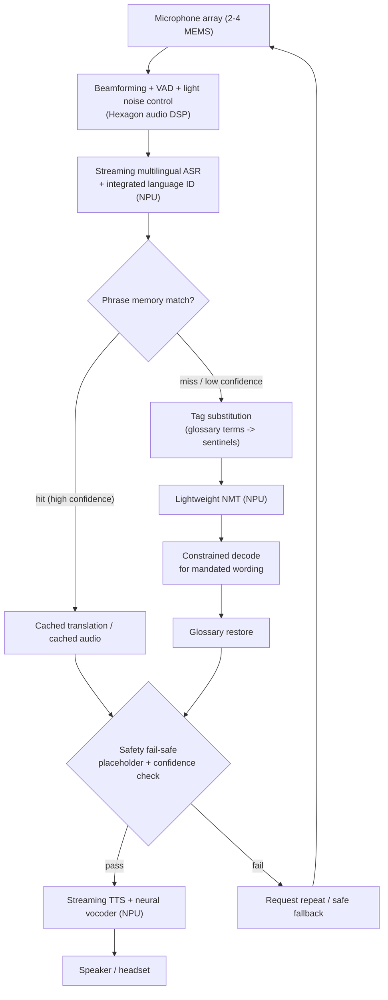
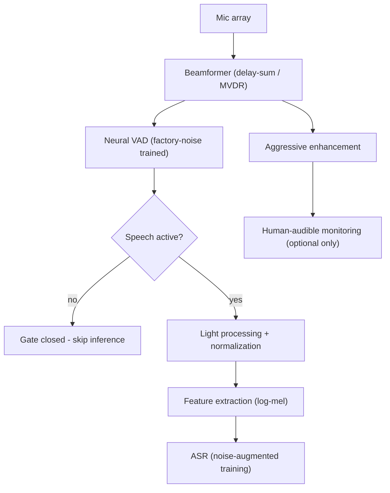
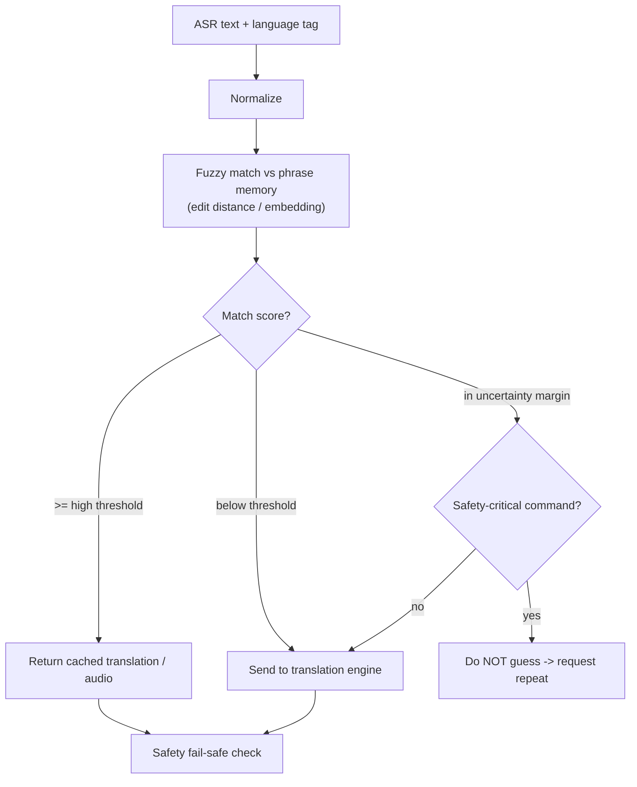
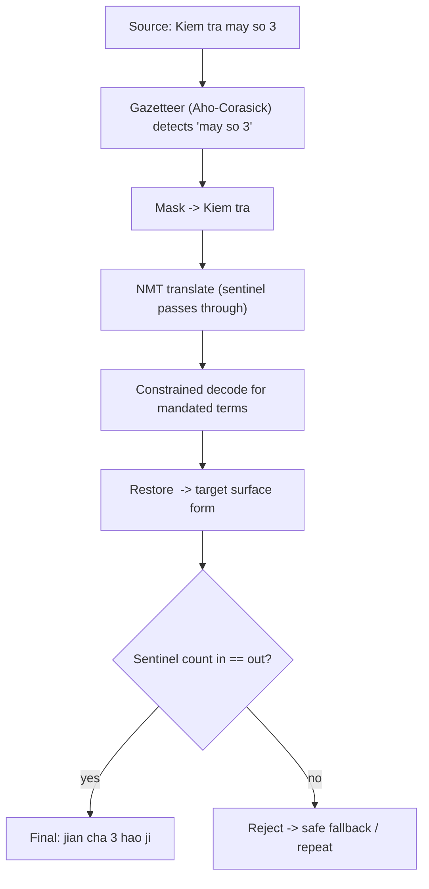
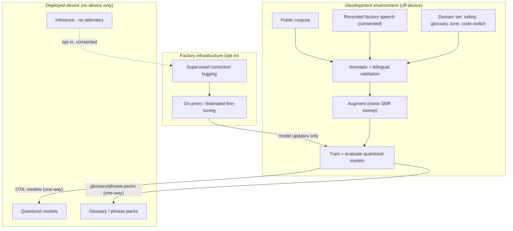

# Vân Ngữ — Technical Deep-Dive

## System Overview
Vân Ngữ is an end-to-end, on-device Edge-AI communication platform that performs speech recognition, language identification, machine translation and speech synthesis entirely on Snapdragon-powered hardware, using Qualcomm AI Hub optimised models. No speech, text or user data is transmitted to external servers during operation.
The architecture is a modular streaming pipeline. Each stage is independently optimised for latency, memory and inference performance, and the work is deliberately distributed across the device’s heterogeneous compute: the always-on audio front-end runs on the Hexagon audio DSP, the AI models run on the Hexagon NPU, and control and routing run on the CPU. Two design principles run throughout: the pipeline streams (it does not wait for a complete recording before acting), and safety-critical communication is gated rather than assumed correct.

---

### 1. Audio Processing Layer
Speech is captured by a small MEMS microphone array (two to four elements) rather than a single microphone. The array is what makes directional rejection of machine noise possible: with multiple elements the system can apply spatial filtering — delay-and-sum beamforming as a baseline, and an adaptive (MVDR-type) beamformer to steer towards the speaker and suppress directional noise sources. Inter-element spacing is chosen relative to the highest frequency of interest to avoid spatial aliasing. (A single-microphone variant remains possible for cost-reduced units, but it cannot perform beamforming and would rely on single-channel suppression only.)
The front-end runs on the always-on, low-power Hexagon audio DSP and performs:
Voice Activity Detection (a small neural VAD trained on industrial noise, since energy-threshold VAD fails against non-stationary, impulsive machine noise).
Noise control and audio normalisation.
Acoustic echo cancellation where an open speaker is used (omitted for closed headsets).
End-of-speech detection.
Design choice — the recognition path is decoupled from aggressive enhancement. The ASR model receives VAD-gated, lightly processed audio and is trained on noisy and augmented factory speech for robustness. Heavy denoising is reserved for any human-audible monitoring output, because strong enhancement introduces artefacts that a recogniser trained on clean audio has never seen and that can raise recognition error. Gating inference to active speech also avoids wasted computation and power during silence.
Latency note. The trailing-silence wait used to declare end-of-speech (roughly 300–500 ms) is a dominant, hardware-independent component of overall latency and is budgeted as such.

### 2. Automatic Speech Recognition (ASR)
The gated audio stream is recognised by a single multilingual streaming ASR model covering Vietnamese and Mandarin. A streaming architecture (a chunked Conformer or an RNN-T transducer with bounded right-context) is used deliberately in place of non-streaming transcription models that consume a fixed multi-second window: the streaming model emits tokens during speech, so at end-of-speech only a short final chunk remains to process. This is the difference between a transcription tool and a real-time communication device.
Integrated language identification. Because the model is multilingual, it self-identifies the spoken language and tags its output. This removes the need for a separate post-recognition language-detection stage and, importantly, handles the intra-sentence code-switching that factory staff use routinely. A near-free script-level check (Han characters versus Latin-with-diacritics) provides a confirming sanity check.
Tonal-language handling. Both languages are tonal (Mandarin: four tones plus neutral; Northern Vietnamese: six). Tone is carried in the low-frequency pitch contour, which is fragile under both aggressive denoising and low-bit quantisation. The system therefore uses quantisation-aware training rather than naive post-training quantisation, tunes the front-end to preserve harmonic structure, and measures tone-confusion error explicitly (Section 7) rather than hiding it inside an aggregate error rate.
Models are deployed via Qualcomm AI Hub and executed on the Hexagon NPU. Example output: “Máy ép đang bị kẹt.” / “压机卡住了。”

### 3. Language Identification and Routing
Language routing is handled inline by the multilingual ASR described above rather than as a separate model: the recognised language tag selects the translation direction (Vietnamese → Mandarin or Mandarin → Vietnamese) automatically, with no manual switching. For code-switched utterances, routing is applied per span rather than per whole utterance, so a sentence that mixes the two languages is translated coherently. This restructuring removes the ambiguity of the original design, in which language was detected only after recognition and therefore could not have influenced which recogniser ran.

### 4. Phrase Memory
Industrial communication is highly repetitive, so before invoking the translation model the system checks a local phrase memory of frequently used commands (for example: stop the production line; check machine number three; wear a safety helmet; emergency shutdown). On a match, the stored translation — and optionally a cached audio clip — is returned immediately, bypassing neural translation and sharply reducing latency.
Robust matching. Exact string matching is too brittle, because the recogniser will phrase the same command slightly differently from one utterance to the next. Matching therefore uses normalised edit distance or embedding similarity against a threshold.
Safety gating. The match threshold is treated as a safety parameter, not a convenience setting. A fuzzy false-positive could return a confident but wrong safety instruction — for instance collapsing “do not switch off” into “switch off”. Below a confidence margin the system does not guess: it falls through to full translation or asks the speaker to repeat. Negation and antonym near-misses are explicitly guarded and tested (Section 7).

### 5. Context-Aware Translation Engine
For sentences not held in phrase memory, a lightweight Neural Machine Translation model translates with industrial terminology guaranteed by mechanism rather than corrected after the fact. Two complementary mechanisms are used:
Tag substitution (default). Glossary terms — machine names, line identifiers, SOP codes, PPE, equipment — are detected with a per-factory gazetteer and replaced with typed placeholder tokens that pass through translation untouched, then restored in the target language. This is deterministic, adds almost no latency, and guarantees that a machine number or SOP code is never mistranslated. It is unusually reliable for this language pair because both Vietnamese and Mandarin are morphologically light, so a restored term drops cleanly into the target sentence.
Lexically-constrained decoding (mandated wording). For safety phrases that must use one official target wording, a bounded-beam constraint forces that exact phrase into the output. This is reserved for the small mandated set, since it adds search overhead.
The translation model is fine-tuned to handle the placeholder tokens, and a placeholder-count check acts as a fail-safe: if the tokens going in do not match those coming out, the output is rejected and the system falls back to a safe rendering or a request to repeat. Context is supplied to translation during inference (machine names, line identifiers, safety terminology, SOPs and company vocabulary), producing accurate and consistent industrial communication.

### 6. Text-to-Speech (TTS)
The translated sentence is synthesised by a lightweight acoustic model paired with a quantised neural (GAN-type) vocoder. The vocoder choice matters: a non-autoregressive vocoder produces an audio chunk in one pass, giving a short time-to-first-sample, and synthesis streams so that playback begins before the whole utterance is generated. What the worker perceives is the time to first audio, which is what the system optimises.
Frequently used safety announcements are played from locally cached audio for near-instant delivery. Output is delivered through a Bluetooth headset, a bone-conduction headset, or an integrated speaker.
Edge AI Runtime
All models execute locally using Qualcomm AI Hub optimised models and Snapdragon acceleration. Responsibilities are mapped across the device’s heterogeneous compute as follows:

Footprint. All models are quantised; peak co-resident footprint is on the order of 150–250 MB, well within device memory. The autoregressive decode stages (ASR, NMT, TTS) are memory-bandwidth-bound rather than compute-bound, so the optimisation levers are quantisation and short output sequences (including phrase-memory hits) rather than raw compute throughput.
No speech, text or user data is transmitted to external servers.
Performance Objectives
Fully offline inference.
Real-Time Factor below 1.0 and latency reported separately. RTF measures whether the system keeps up with the audio stream; latency measures responsiveness. The two are distinct and both are reported.
Time from end-of-speech to first translated audio below approximately two seconds for short operational commands, with the phrase-memory path noticeably faster.
Latency reported as p50 / p95 / p99, since a single mean hides the longer-sentence tail.
Low memory footprint through quantised models, and energy-efficient operation through offloading the always-on front-end to the audio DSP.

### Scalability
The modular pipeline supports additional languages and industries without redesign. Two points govern how it scales:
Language growth. Pairwise translation grows with the square of the number of languages. Beyond the initial pair, the system moves to a single many-to-many multilingual translation model (trading a larger footprint for linear scaling) rather than adding a separate model per direction.
Deployment across factories. Terminology is delivered as per-factory glossary and phrase-memory packs — versioned configuration pushed to the device — with over-the-air updates of those packs and of the quantised models, and hardware tiers mapped to Snapdragon SKUs. This configuration plane, not the inference pipeline alone, is what makes the product deployable at fleet scale.
Planned extensions include Vietnamese ↔ English and Vietnamese ↔ Korean, multi-speaker conversations and speaker identification, and OCR- and camera-assisted contextual understanding.

---

# Additional Diagrams, References & Source Parts
## Diagram 2 — Hardware compute allocation

Work is split across the device's heterogeneous compute. The key correction versus the original proposal: the always-on front-end lives on the **Hexagon audio DSP**, not the CPU.

```mermaid
flowchart LR
    subgraph DSP["Hexagon audio DSP - always on, low power"]
        d1["Beamforming"]
        d2["Voice Activity Detection"]
        d3["Noise control"]
        d4["Feature extraction"]
    end
    subgraph NPU["Hexagon NPU / HTP - 48 INT8 TOPS"]
        n1["Streaming ASR + language ID"]
        n2["Neural Machine Translation"]
        n3["TTS acoustic model + neural vocoder"]
    end
    subgraph CPU["Kryo CPU"]
        c1["Device control + UI"]
        c2["Audio routing"]
        c3["Glossary / gazetteer lookup"]
        c4["Phrase-memory matching"]
        c5["End-of-speech logic"]
    end
    subgraph MEM["Storage + Memory"]
        m1["Quantized models (~150-250 MB)"]
        m2["Industrial knowledge base"]
        m3["Config / glossary packs"]
        m4["Audio + inference buffers"]
    end
    DSP --> NPU
    CPU --> DSP
    CPU --> NPU
    MEM --- NPU
    MEM --- CPU
```

---

## Diagram 3 — Audio front-end signal chain

Shows the single most important front-end fix: the **ASR path receives only light processing** (and is trained on noisy audio), while aggressive enhancement is a *separate* branch reserved for human-audible output. Feeding heavily denoised audio into the recogniser is what raises error.

---

## Diagram 4 — Phrase memory with safety gate

The match threshold is treated as a **safety parameter**. In the ambiguous margin the system refuses to guess on safety-critical commands and asks for a repeat, rather than risk a confident inversion.

---

## Diagram 5 — Context engine (tag substitution + constrained decoding)

Worked example for "Kiểm tra máy số 3" → "检查3号机". The machine id is masked before translation and restored after, so it can never be mistranslated. A placeholder-count mismatch triggers rejection.

*Mandated-wording example:* "Dừng dây chuyền" is forced to the official "停止生产线" by lexical constraint rather than left to the model's free choice.

---

## Diagram 6 — Latency budget (end-of-speech to first audio)

Estimated stage budget on QCS8550, short command, streaming-ASR path. The **endpoint silence wait plus the two autoregressive stages (NMT, TTS) dominate** — and the phrase-hit path skips NMT entirely.

*Total ≈ 0.8–1.5 s to first audio for short commands. Confirm each stage by profiling on real QCS8550 hardware via Qualcomm AI Hub Workbench, then replace these estimates with measured numbers. Report p50/p95/p99, not a mean.*

---

## Diagram 7 — Data handling & privacy boundary

Resolves the apparent contradiction between "fully offline" and "keeps improving." Configuration flows **one way** to the device; raw speech never leaves the factory; improvement data is collected only through opt-in, consented channels.

---

## References

### Platform & tooling
- **Qualcomm Dragonwing QCS8550** — 48 INT8 / 12 FP16 TOPS, Hexagon HTP (HVX + HMX), dedicated Hexagon audio DSP, Sensing Hub, Kryo CPU, Adreno 740, 4 nm. Confirmed via the Lantronix Open-Q 8550CS SOM product material: https://www.lantronix.com/products/open-q-8550cs-som-development-kit/
- **Qualcomm AI Hub** — optimized on-device models and on-device latency/memory profiling (Workbench): https://aihub.qualcomm.com
- **Whisper on AI Hub** — model sizes and the fixed 30-second (80×3000) input window that motivates choosing a streaming ASR instead: https://aihub.qualcomm.com/iot/models/whisper_base

### Speech & text datasets
- **VIVOS** (Vietnamese read speech, ~15 h): https://huggingface.co/datasets/AILAB-VNUHCM/vivos
- **Mozilla Common Voice** (Vietnamese): https://commonvoice.mozilla.org/datasets
- **VLSP** ASR challenge corpora (Vietnamese) — VLSP shared tasks.
- **FLEURS** (Vietnamese + Mandarin, parallel read speech): https://huggingface.co/datasets/google/fleurs
- **VietMed** (Vietnamese medical-domain ASR) — closest public analog to specialized-vocabulary-in-noise.
- **AISHELL-1** (Mandarin ASR, ~170 h, Apache-2.0): https://www.openslr.org/33/
- **AISHELL-3** (multi-speaker Mandarin TTS with pinyin/tone labels): arXiv:2010.11567
- **AISHELL-4** (8-channel mic-array Mandarin, for beamforming work).
- **KeSpeech** (Mandarin + 8 sub-dialects).
- **MUSAN** (noise/music/speech, CC): arXiv:1510.08484
- **DEMAND** (multichannel environmental noise, 18 environments).
- **NOISEX-92** (noise incl. real factory-floor and machinery) — closest to the target acoustic environment.
- **OPUS** (OpenSubtitles, TED2020) for Vi↔Zh parallel text — bootstrap only; known short/noisy: https://opus.nlpl.eu
- Low-resource Vi↔Zh back-translation reference: arXiv:2003.02197

### Methods
- **Conformer** ASR encoder — Gulati et al., 2020 (arXiv:2005.08100).
- **RNN-T transducer** (streaming) — Graves, 2012 (arXiv:1211.3711).
- **Zipformer** (efficient encoder) — Yao et al., 2024 (arXiv:2310.11230).
- **wait-k simultaneous translation** — Ma et al., 2019 (arXiv:1810.08398).
- **Lexically constrained decoding** — Hokamp & Liu, 2017 (grid beam search, arXiv:1704.07138); Post & Vilar, 2018 (dynamic beam allocation, arXiv:1804.06609).
- **MMSE log-spectral speech enhancement** — Ephraim & Malah, 1985 (with decision-directed a-priori SNR).
- **Statistical VAD** — Sohn, Kim & Sung, 1999.
- **MVDR / Capon beamforming** — Capon, 1969.
- **MT evaluation** — COMET: Rei et al., 2020 (arXiv:2009.09025); chrF: Popović, 2015; sacreBLEU: Post, 2018 (arXiv:1804.08771).

*Hardware figures and dataset/tooling links above were verified against current vendor and repository pages. Method entries are standard published references; confirm exact citation format for your submission's style.*

---

## Source parts (hardware bill of materials)

Indicative components to source for a portable industrial unit. The compute module confirms the architecture: the QCS8550 ships as a production SoM with the dedicated always-on audio DSP the design relies on.

| Subsystem | Part / option | Source | Notes |
|---|---|---|---|
| Compute (primary tier) | Qualcomm Dragonwing **QCS8550** SoM — Lantronix **Open-Q 8550CS** or Thundercomm **TurboX C8550** | Mouser; Atlantik Elektronik; BCD Atlantik; Thundercomm | Production-ready; 48 INT8 TOPS; dedicated Hexagon audio DSP; Open-Q is TAA/NDAA-compliant with ~10-yr longevity. |
| Compute (low-power tier) | Qualcomm **QCS6490** SoM (e.g. Qualcomm RB3 Gen 2 / Thundercomm / Lantronix 6490 modules) | Thundercomm; Lantronix; Qualcomm | For a lighter wearable variant; tighter memory/TOPS — validate model footprint here. |
| Microphone array | 2–4 **MEMS** mics (PDM or I2S), e.g. Knowles, Infineon XENSIV IM69D, or TDK InvenSense ICS series, on a far-field array layout | Mouser / DigiKey / Arrow | Replaces the single electret in the original schematic; required for beamforming. Fix inter-mic spacing vs highest frequency of interest. |
| Audio codec / amplifier | I2S audio codec + speaker amplifier (e.g. TI / Cirrus Logic class) | Mouser / DigiKey | Output path and any open-speaker drive. |
| Output transducer | Bluetooth headset + **bone-conduction** option; integrated speaker | COTS | Bone-conduction recommended for high-noise floors. |
| Power | Li-ion/LiPo pack + PMIC/charger sized to the SoM | COTS | Portable operation; the audio-DSP offload is what keeps always-on power low. |
| Enclosure | Industrial-rated (dust/impact), comfortable for shift-long wear | Custom | Factory environment; consider IP rating. |
